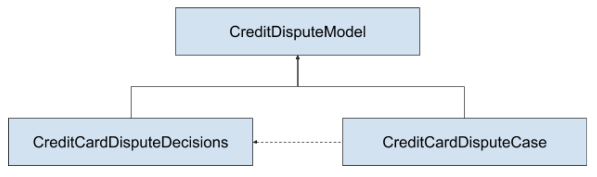
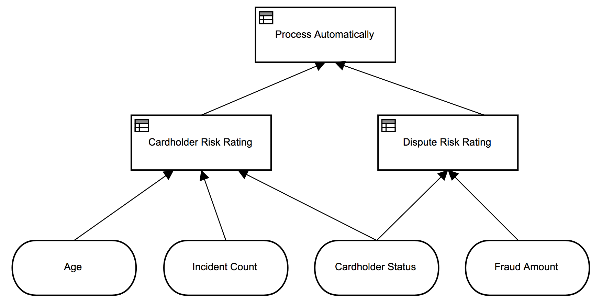
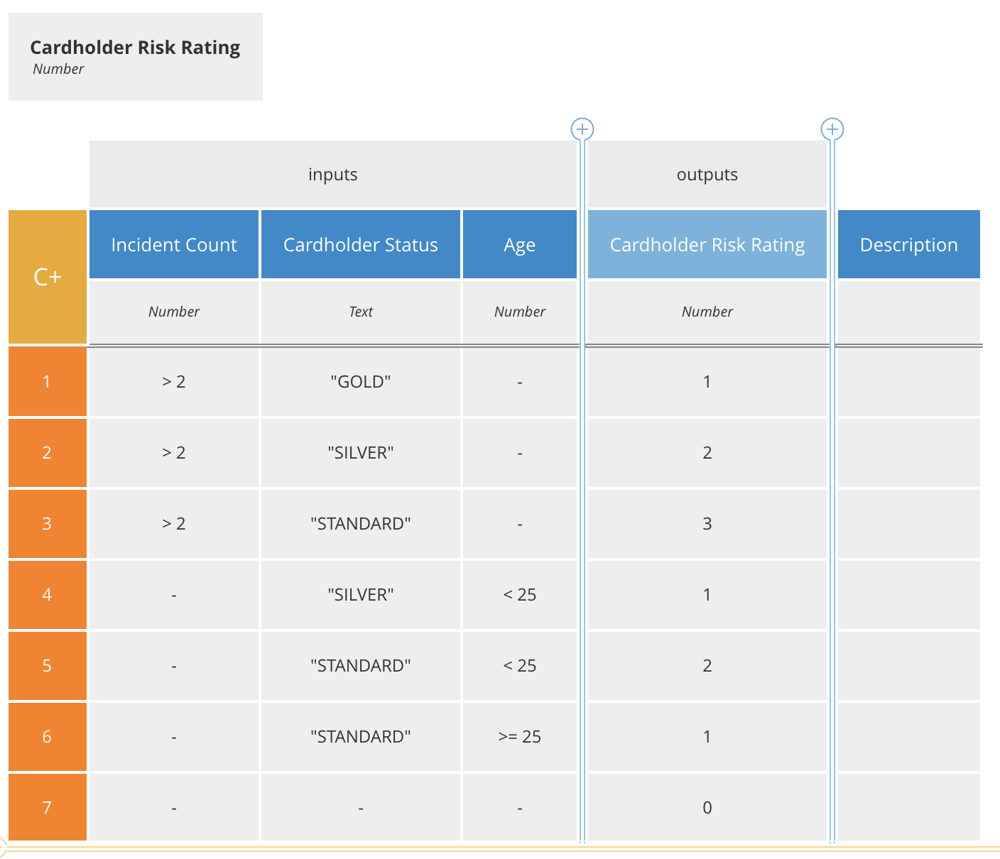
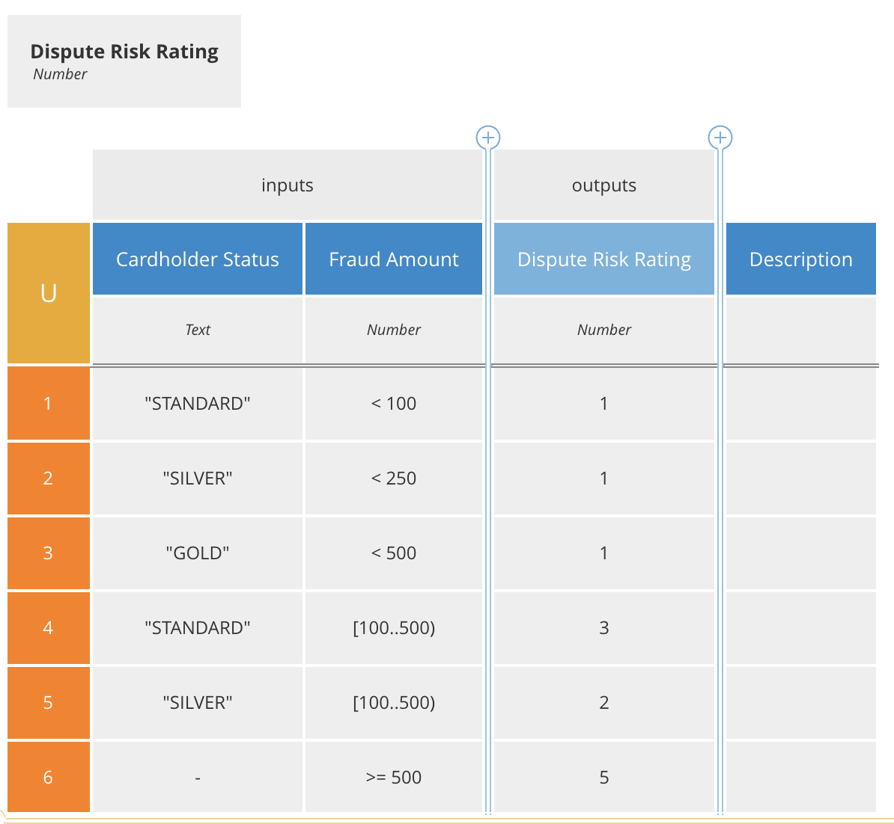
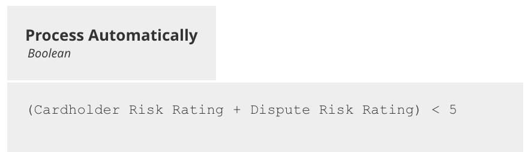
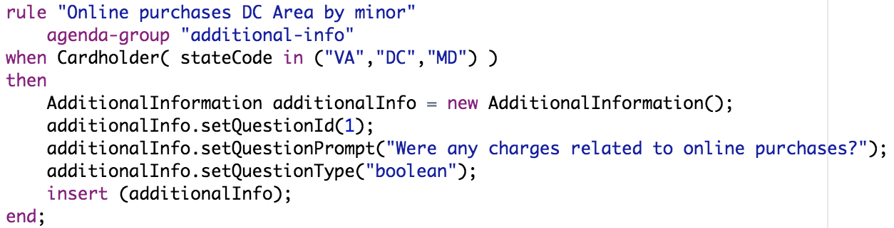
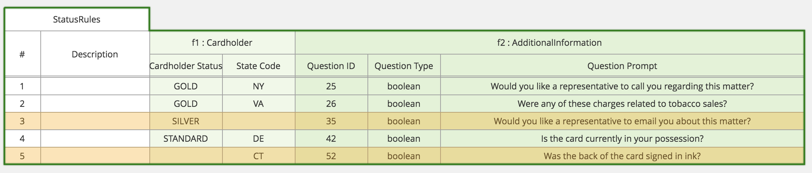

# KIE Components for the FSI Credit Dispute demo app

## Projects

This is a collection of KIE projects with following relationship:

* Both the decisions project and case project have a direct Maven dependency on the model
* The Case project remotely invokes the decisions using a work item handler defined in the deployment descriptor using the maven coordinates of the decisions project
  * Can add a scanner as a fourth parameter expressed in ms
  * The FraudDispute process uses the new Decision Task
  * The decisions project includes the LocalDMNProcess that illustrates a local DMN invocation

## Domain Objects

* Cardholder
  * age:integer
  * balanceRatio: Float
  * incidentCount: integer
  * stateCode: String
  * status: String (GOLD|SILVER|STANDARD)
* FraudData
  * automated: boolean
  * customerStatus: String (GOLD|SILVER|STANDARD)
  * lineItemCount: Integer
  * maxDaysElapsed: Integer
  * totalFraudAmount: Float
* AdditionalInformation
  * questionId: Integer
  * questionPrompt: String
  * questionType: String (text,boolean,date,number)
  * answerValue: String

## Rest endpoints of interest

See the kie-test-util project for examples on invoking DMN decision through java api.

Includes a [Postman Collection](kie-test-util/fsi-credit-dispute.postman_collection.json) with all the relevant calls for the demo:

* Calling Additional Info rules for dynamic questions
* Invoking Automatic Processing decision
* Starting a Case (resulting in automatic or manual processing)

## Automatic Processing decision

There are several steps in the decision:

* Calculating cardholder risk
  * 
* Calculating dispute risk
  * 
* Determining manual vs. automatic processing based on the risk scores
  * 

## Additional Information Dynamic Questions

Input a cardholder and get a list of additional questions required.  Some examples:

